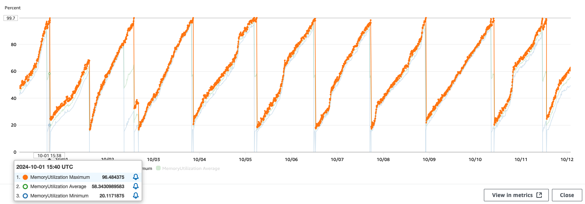

# Fullstack Challenge #1

This challenge is inspired by a real-world problem. Feel free to ask any questions during the challenge.

### Description
Centralized exchanges often require whitelisting IP addresses for secure API access and specific requests. However, IP addresses can change, causing disruptions in user-facing applications that aggregate CEX data. To mitigate this, we provide some proxy IP addresses to access CEX APIs.

### Issue and task
We have recently observed that proxy instances on our ECS are being periodically redeployed. Upon reviewing the metrics, we noticed the following memory usage pattern:

Clone this repository, reproduce the problem locally, and provide a solution to fix this issue.

